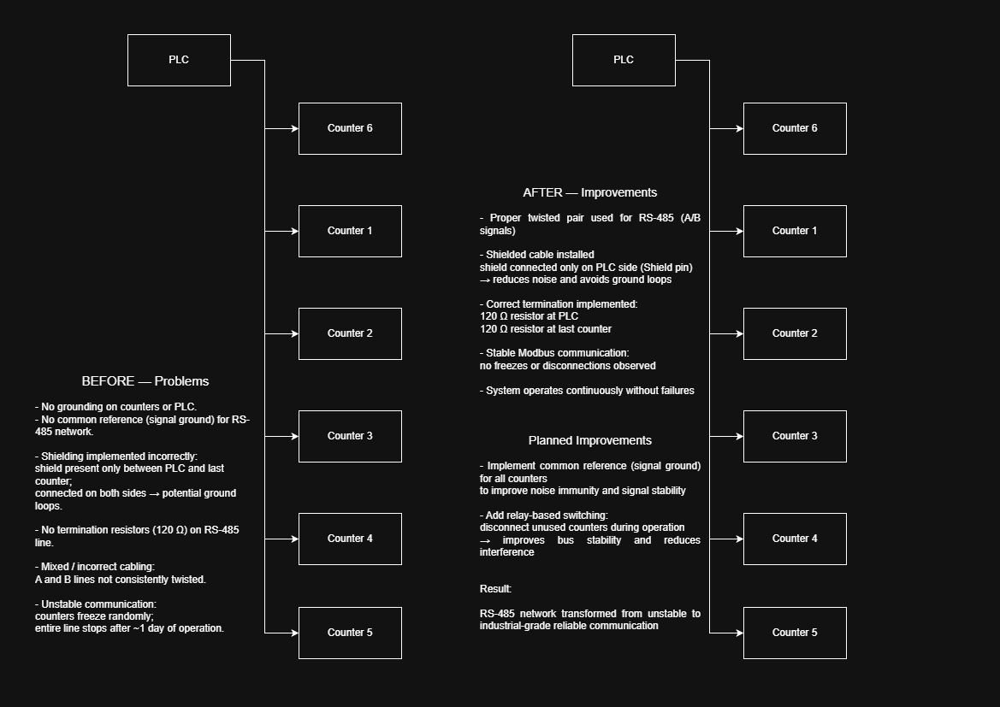

# Industrial Meter Tracking System Modernization

## Overview

This repository describes the analysis, recovery and modernization of an industrial meter tracking system used on a corrugated cardboard production line.

The system collects production length and counter data from industrial counters via RS-485 / Modbus RTU, processes it in a PLC, visualizes it through SCADA/HMI and prepares data for database storage and external reporting systems.

This is an anonymized portfolio case study based on a real industrial automation project.

---

## System Architecture

### Main data flow

    Measuring wheels / counters
            ↓
    RS-485 / Modbus RTU
            ↓
    PLC logic
            ↓
    GVL / history buffer
            ↓
    WinCC SCADA
            ↓
    SQL Server
            ↓
    ERP / reporting system

---

## My Role

When I joined the project, the system already existed, but it worked unreliably and required constant attention.

My work focused on understanding, recovering and improving the system.

I worked on:

- analyzing the existing PLC, HMI, WinCC and SQL data flow
- restoring operation of a non-working production line
- diagnosing RS-485 / Modbus communication problems
- improving counter data processing logic
- reducing noisy and incorrect database records
- improving communication reliability
- documenting the system architecture and modernization process

Some parts of the PLC logic already existed before my work.

My contribution was focused on system analysis, troubleshooting, modernization, reliability improvement and documentation.

---

## Main Problems

The original system had several reliability and data quality issues:

- unstable RS-485 communication
- counters freezing or disconnecting during production
- incorrect or inconsistent wiring practices
- no common RS-485 reference point
- incomplete shielding and grounding strategy
- missing or incorrect bus termination
- noisy database records during counter reset events
- multiple values written when only one valid production value was needed
- limited documentation for the modified counters and existing PLC logic

---

## Key Improvements

### 1. RS-485 Communication Reliability

The RS-485 network was one of the main sources of instability.

Improvements included:

- replacing old communication wiring with shielded twisted-pair cable
- ensuring A/B RS-485 signals are routed through the same twisted pair
- connecting the cable shield only on the PLC side
- adding 120 Ω termination resistors at the correct bus endpoints
- analyzing the need for a common reference point between counters

After these changes, the counter network works reliably without regular communication failures.

---

### 2. Counter Data Processing

The original logic produced noisy data during counter reset events.

Improvements included:

- detecting sudden counter value drops as reset events
- capturing the last valid meter value before reset
- filtering invalid overflow values
- storing one clean production value instead of multiple noisy records
- using buffer variables for transfer and diagnostics

This improved the quality of data prepared for SCADA / SQL storage.

---

### 3. PLC Logic Understanding and Documentation

The PLC project contains both Structured Text and Function Block Diagram logic.

Documented logic includes:

- shift detection and state tracking
- counter reset detection
- pulse duration analysis
- Modbus recovery logic
- PLC-to-database transfer handshake
- global variables and history buffer structure
- main production line analysis block

---

## Repository Structure

    .
    ├── diagrams/       # System architecture and RS-485 improvement diagrams
    ├── docs/           # Project documentation and engineering analysis
    ├── hmi/            # HMI-related notes and future documentation
    ├── photos/         # Project-related photos and screenshots
    ├── plc/            # PLC logic examples and documentation
    ├── sql/            # SQL-related examples and future documentation
    ├── wincc/          # WinCC-related notes and future documentation
    ├── NOTICE.md       # Repository confidentiality notice
    └── README.md

---

## Documentation

- [System Overview](docs/system-overview.md)
- [Problem Analysis](docs/problem-analysis.md)
- [RS-485 Diagnostics](docs/rs485-diagnostics.md)
- [Modernization Plan](docs/modernization-plan.md)
- [Engineering Lessons](docs/engineering-lessons.md)
- [PLC Logic Overview](plc/README.md)
- [HMI Operator Interface](hmi/README.md)
- [HMI Operator Interface](hmi/README.md)
- [WinCC / SCADA Layer](wincc/README.md)
- [SQL / Reporting Layer](sql/README.md)

---

## PLC Logic

The PLC part of this repository contains anonymized examples and documentation for:

- Structured Text programs
- Function Blocks
- FBD logic
- Global variables
- history buffer structure

Important function blocks:

- CutPoint — detects counter reset events and captures valid meter values
- CalcDeltaT — measures digital sensor pulse duration
- MB_Reset — handles Modbus communication recovery
- Line_AnalizFul — main line state and production analysis block

See: [PLC Logic Overview](plc/README.md)

---

## Technologies Used

- Schneider Electric M241 PLC
- EcoStruxure Machine Expert
- Structured Text (ST)
- Function Block Diagram (FBD)
- RS-485
- Modbus RTU
- Weintek HMI / EBPro
- Siemens WinCC
- Microsoft SQL Server
- ERP / 1C integration concept

---

## Current Status

The system is currently operating reliably after RS-485 wiring improvements and PLC logic corrections.

Planned future improvements:

- implement a verified common RS-485 reference point
- add relay-based RS-485 bus switching for 3-layer / 5-layer production modes
- expand SQL and WinCC documentation
- improve external ERP / 1C data integration

---

## Engineering Value

This project demonstrates practical industrial automation skills:

- troubleshooting real production systems
- working with incomplete documentation
- PLC programming and debugging
- industrial communication diagnostics
- RS-485 / Modbus RTU reliability improvement
- SCADA and database-oriented system thinking
- safe anonymized technical documentation

---

## Notice

This repository does not contain the full industrial project.

Sensitive production details, real addresses, credentials, internal identifiers and plant-specific information have been removed or anonymized.

The goal of this repository is to demonstrate engineering approach, system understanding and modernization work.
