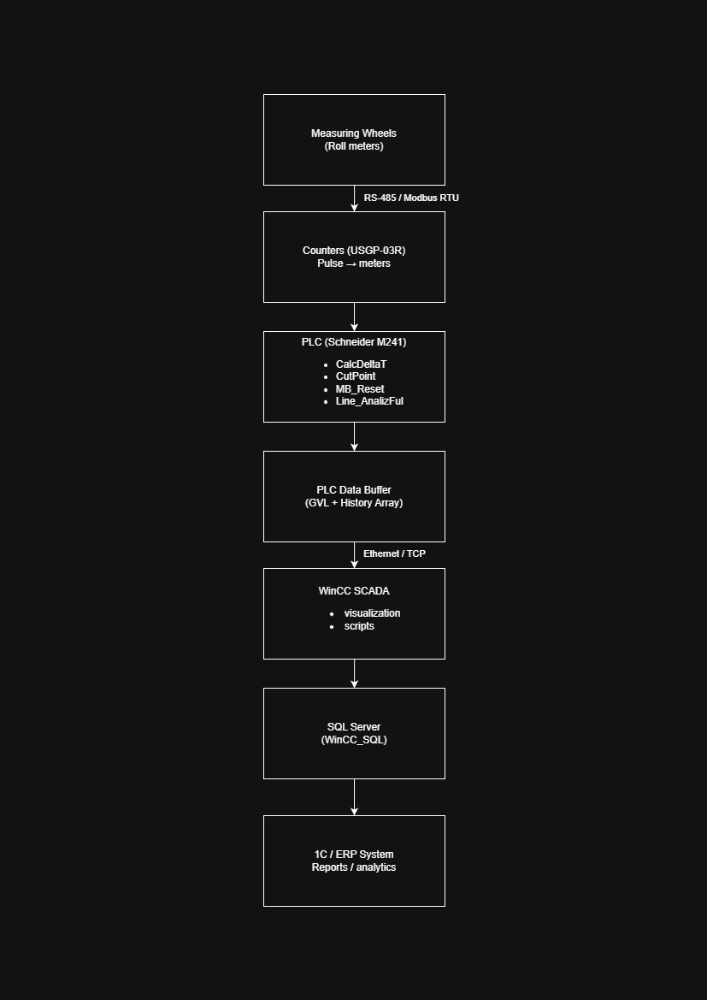

# Industrial Meter Tracking System Modernization

## Overview

This project describes the analysis, recovery and modernization of an industrial meter tracking system used on a corrugated cardboard production line.

The system uses RS-485 / Modbus RTU counters, a PLC, HMI, WinCC SCADA and SQL Server to collect and process production data.

---

## My Role

When I joined the project, the system was already installed but worked unreliably and required constant maintenance.

I had to:
- understand an undocumented system
- learn new tools (Machine Expert, WinCC, SQL integration)
- identify root causes of failures
- restore system operation
- improve reliability and data quality

---

## Key Achievements

- Restored a non-working production line
- Fixed incorrect data handling during counter reset events
- Eliminated noisy and duplicated database records
- Stabilized RS-485 communication
- Replaced communication cable with proper shielded twisted pair
- Ensured correct differential signal routing (A/B)
- Achieved stable operation without daily failures
- Improved system reliability under real production conditions

---

## Technical Highlights

- PLC programming (Structured Text)
- Modbus RTU communication
- RS-485 diagnostics and troubleshooting
- Industrial data processing
- SQL database integration
- SCADA (WinCC)
- System-level debugging (hardware + software)

---

## Documentation

- [System Overview](docs/system-overview.md)
- [Problem Analysis](docs/problem-analysis.md)
- [RS-485 Diagnostics](docs/rs485-diagnostics.md)
- [Modernization Plan](docs/modernization-plan.md)

---

## Project Context

- Real industrial production environment
- Limited downtime for testing
- No complete documentation available
- Required reverse engineering and on-site diagnostics

---

## Status

System is currently operating reliably after implemented improvements.

Further enhancements are planned:
- RS-485 reference implementation
- counter verification
- dynamic bus topology switching (3-layer / 5-layer modes)

---

## Author

Industrial Automation Engineer focused on PLC systems, industrial communication and system reliability.

---

## System Architecture

